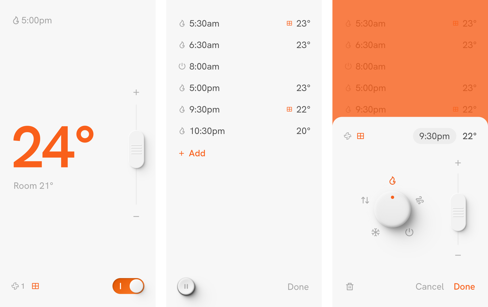

# Dieter

Named after [Dieter Rams](https://en.wikipedia.org/wiki/Dieter_Rams) — the patron saint of quality knobs and buttons — Dieter is a self-hosted scheduler for **Daikin FDYA / BRP15B61 Airbase** heat pumps.

It‘s a PWA, so it installs on your phone’s home screen and behaves like a native app.



## Who is this for?

People who own a Daikin BRP15B61 and are comfortable with the command line. You don‘t need to be a developer, but you do need to be able to SSH into a machine, edit a text file, and run Docker.

## What it does

- Runs time-based schedules — **as many as you like,** including ’off‘ schedules
- Schedules can include changes to fan speed and zone
- Shows live status (set temp, room temp, mode) with **full manual control**
- Allows pausing of scheduled changes if you’re away
- Talks directly to the BRP15B61 on your local network — no Daikin cloud, no accounts, no subscriptions
- Pleases your eyes and brain with easy to grok and use controls

## Requirements

- **Heat pump controller** — Daikin BRP15B61 Airbase
- **Docker host** — any machine that can run Docker: a home server, NAS, old laptop, Raspberry Pi
- **Router** — ability to assign a static IP to the Daikin unit


### Home servers

Dieter needs somewhere to run continuously so it can fire schedules at the right time. A Docker-capable machine that stays on is ideal — a Synology or similar NAS is perfect, but so is any always-on Linux box. If you don’t have one, a Raspberry Pi 4 running Docker is cheap and quiet.


## Current gaps

- Different scheduling per day
- No dry mode (who uses that?)
- Doesn’t support setups with separate per-zone temperatures
- Zone and fan speed discovery and display might be glitchy — only tested on one setup
- Untested on Android
- Untested on units using fahrenheit

## Setup

### 1. Give the Daikin unit a static IP

Log into your router and assign a static DHCP lease to the BRP15B61‘s MAC address. Make a note of the IP — you’ll need it shortly.

### 2. Clone and configure

```bash
git clone https://github.com/yourname/dieter.git
cd dieter
cp .env.example .env
nano .env
```

Minimum config:

```
DAIKIN_HOST=192.168.1.42   # your Daikin's IP
TZ=Pacific/Auckland        # your timezone
PORT=8080
```

Full timezone list: [Wikipedia — tz database](https://en.wikipedia.org/wiki/List_of_tz_database_time_zones)


### 3. Start the container

```bash
docker compose up -d --build
```

The first build takes a few minutes. After that, visit `http://<host-ip>:8080`.

## Using Dieter

Dieter runs in any modern browser on your home network — desktop, tablet, or phone. Point it at `http://<host-ip>:8080` and you‘re done.

On phones it’s best installed as a home screen app so it feels native rather than living in a browser tab.

**iOS (Safari):** Share → Add to Home Screen

**Android (Chrome):** Menu → Add to Home Screen

### Remote access

Dieter only listens on your local network. That‘s a feature, not a limitation — but it does mean you can’t reach it from outside your home without some extra plumbing. [Tailscale](https://tailscale.com) is the easiest way to sort this: install it on your phone and your Docker host, and your home network follows you everywhere.

## Updating

```bash
git pull
docker compose up -d --build
```

## Troubleshooting

**“Unit unreachable”** — Check `DAIKIN_HOST` in `.env` matches the unit‘s IP. The host running Dieter and the Daikin unit need to be on the same network.

**Schedules not firing** — Make sure `TZ` is set correctly. Check logs with `docker compose logs backend -f`.

**App not loading** — `docker compose logs frontend`

## Security

Dieter has no authentication. Anyone on your network who knows the IP and port can control your heat pump.

That’s fine for most home setups — your LAN is presumably not full of people you distrust. But it‘s worth being aware of. Don’t expose port 8080 to the internet directly. 

There are a few things here which could be improved with additional layers of API keys, which if you’re forking this are fairly straight forward. The only real surface area though is “bad actor can control your heating” so your s**ts given may be low.

## Credits

Much respect and appreciation to [DRAMs Framer components](https://drams.framer.website/) by [@mrblackstudio](https://x.com/mrblackstudio) for the inspo on the UI controls

## License

MIT
